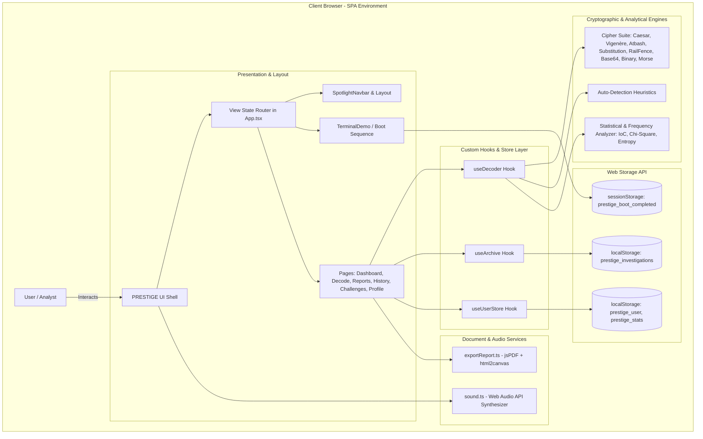

# Technical Architecture Specification — PRESTIGE

## 1. System Overview
PRESTIGE is a client-side Single Page Application (SPA) built using React 18, TypeScript, TailwindCSS, and Framer Motion. The application operates entirely within the user's browser, adopting a local-first paradigm: all cryptographic computations, statistical models, intelligence dossier generations, and session state persistence occur on the client machine with zero external network dependencies.

---

## 2. Architecture Diagram



---

## 3. Frontend Architecture

### 3.1 Routing & Application Shell
The application routes are managed through a centralized state machine in `src/App.tsx`. Rather than relying on a heavy browser router library, PRESTIGE uses a lightweight, reactive view switcher (`activeTab: 'dashboard' | 'decode' | 'reports' | 'history' | 'faq' | 'challenges' | 'leaderboard' | 'profile'`). This guarantees instant, zero-latency transitions without hash or server fallback misconfigurations.

### 3.2 Component Directory Breakdown
- `src/components/layout/`: Global shell layout components (`SpotlightNavbar.tsx`, `ProfileDropdown.tsx`, `AnimatedFooter.tsx`).
- `src/components/features/decoder/`: Decoding interface modules (`DecodingWorkspace.tsx`, `CipherControls.tsx`, `FrequencyChart.tsx`, `TerminalOutput.tsx`, `DecodedResultModal.tsx`).
- `src/components/features/archive/`: Archival and investigation managers (`SaveInvestigationModal.tsx`, `FolderPreview.tsx`).
- `src/components/features/settings/`: Preferences and boot sequence replay modal (`SettingsModal.tsx`).
- `src/components/features/legal/`: Terms and Privacy policy modal (`TermsPoliciesModal.tsx`).
- `src/components/ui/terminal.tsx`: Reusable macOS-style terminal container, typing animations, and colored span tokens.
- `src/components/terminal-demo.tsx`: PRESTIGE OS interactive terminal boot sequence with A.J. Pardhiv attribution.

### 3.3 State Management & Hooks
1. **`useDecoder.ts`:** Manages active ciphertext, selected cipher type, algorithm parameters (shifts, keys, rails), frequency analysis calculation, verification state, and decoding execution.
2. **`useArchive.ts`:** Coordinates CRUD operations for investigation entries, synchronizing directly with `localStorage`.
3. **`useUserStore.ts`:** Manages user profile information, XP progression, level calculations, solved challenge records, and session login state.

---

## 4. Cryptographic Data Flow

```text
1. User enters raw ciphertext in DecodingWorkspace
      │
2. Auto-Detection triggers (src/utils/ciphers/detector.ts)
   ├── Character set classification (Binary / Hex / Base64 / Alphabetic)
   ├── Monogram distribution correlation against standard English (0.065)
   └── Candidate ranking output
      │
3. Frequency Engine computes metrics (src/utils/frequency.ts)
   ├── Calculates Monogram frequencies (A-Z)
   ├── Computes Index of Coincidence (IoC)
   ├── Calculates Chi-Squared (χ²) Goodness-of-Fit
   └── Computes Shannon Entropy
      │
4. User selects Cipher & adjusts parameters (Shift / Key / Rail count)
      │
5. Engine executes algorithmic decryption (src/utils/ciphers/*)
   └── Decoded plaintext generated instantaneously in memory (< 5ms)
      │
6. Verification layer compares against target plaintext / flag format
      │
7. Result rendered in workspace & emitted to history/report pipeline
```

---

## 5. Persistence Architecture

PRESTIGE utilizes the browser's native **Web Storage API**. No remote databases or external servers are contacted.

| Storage Key | Storage Mechanism | Purpose | Lifespan |
|---|---|---|---|
| `prestige_boot_completed` | `sessionStorage` | Tracks if the terminal boot sequence was displayed | Active browser session / tab |
| `prestige_investigations` | `localStorage` | Serialized JSON array of saved investigations | Persistent across browser restarts |
| `prestige_user` | `localStorage` | Authenticated user profile and credentials | Persistent |
| `prestige_user_stats` | `localStorage` | XP points, solved count, accuracy rate | Persistent |
| `prestige_theme` | `localStorage` | Theme preference (`dark` or `light`) | Persistent |

---

## 6. Report Generation Architecture
The intelligence reporting engine (`src/utils/exportReport.ts`) utilizes:
- **`jspdf` (v4.2.1):** Generates structured PDF documents with vector headers, classified classification blocks, tabular metadata, and monospaced cryptographic transcripts.
- **`html2canvas`:** Captures visual components (such as monogram frequency distribution charts) into high-resolution canvas elements, embedding them as base64 images within the PDF document.
- All PDF assembly occurs on a dedicated offscreen canvas, preventing layout shifts or visual interruptions to the main UI.

---

## 7. Animation Architecture
- **Library:** Framer Motion (`13.4.6`).
- **Core Tokens (`src/lib/motion.tsx`):**
  - **Durations:** Fast (0.15s), Normal (0.25s), Slow (0.4s).
  - **Easing:** Apple/Linear-inspired ease-out cubic blend (`[0.16, 1, 0.3, 1]`) and micro-interaction ease (`[0.4, 0, 0.2, 1]`).
  - **Transitions:** Handled through `<AnimatePresence mode="wait">` wrapping route views.
- **Reduced Motion:** Fully integrated with `useReducedMotion()`. When `prefers-reduced-motion: reduce` is active at the OS level:
  - Slide/translation offsets ($y: 8px \to 0$) collapse to instant opacity fades or zero-duration transitions.
  - Perpetual background animations halt immediately.

---

## 8. Security Architecture

### 8.1 Data Privacy & Sandboxing
- Because PRESTIGE is completely client-side, sensitive plaintexts, keys, and investigations never cross network boundaries.
- No third-party tracking scripts, analytic cookies, or external CDN dependencies are loaded at runtime.

### 8.2 Client-Side Limitations
- Authentication is handled locally via `src/services/auth.ts`. Passwords and user sessions stored in `localStorage` are designed for demonstration, local practice, and state isolation; they are not equivalent to a hardened multi-tenant cryptographic backend.
- Cross-Site Scripting (XSS) defense relies on standard React DOM escaping and `DOMPurify` during PDF chart rendering.

---

## 9. Backend & Production Infrastructure

### 9.1 Backend Architecture
- **Current backend architecture:** Not currently implemented.
- **Server entry point:** Not currently implemented.
- **Service layer:** Client-side TypeScript services only (`auth.ts`, `sound.ts`, `storage.ts`).
- **Controllers / routes:** Not currently implemented.
- **Middleware:** Not currently implemented.
- **API conventions:** Not currently implemented.

### 9.2 API Framework
- **API Framework:** Not currently implemented.

### 9.3 Database & ORM
- **Database:** None (Local browser `localStorage` and `sessionStorage` only).
- **ORM:** Not currently implemented.

### 9.4 Caching & Background Processing
- **Caching:** Browser HTTP caching via standard Vite static asset hashing (e.g. `index-DsjndDNF.js`). No server-side caching layer.
- **Background Jobs:** Not currently implemented. All algorithms run synchronously on the main thread via optimized lookup tables.

### 9.5 Production Shipping Checklist

- [x] Production build passes cleanly with zero TypeScript errors (`npm run build`).
- [x] Environment variables configured (Standard Vite defaults; no external secrets required).
- [x] Authentication verified (Local-first mock authentication operational).
- [ ] Authorization verified (Role-based server authorization: Not currently implemented).
- [x] Input validation verified (Ciphertext sanitized; algorithm bounds checked).
- [x] Error handling verified (Graceful error boundaries on decode failures and storage reads).
- [ ] Database migrations verified (Database: Not currently implemented).
- [x] File storage verified (Client-side dynamic PDF generation and downloads verified).
- [x] Caching verified (Static asset hashing enabled via Vite bundler).
- [ ] Background jobs verified (Background jobs: Not currently implemented).
- [x] Logging verified (Clean browser console; development-only logs stripped).
- [ ] Monitoring verified (Remote observability: Not currently implemented).
- [x] Testing verified (Automated type checking via `tsc` + comprehensive browser subagent QA).
- [ ] CI/CD verified (CI/CD pipeline: Not currently implemented).
- [x] Deployment verified (Production build output verified in `dist/`).
- [x] Security headers verified (Ready for standard CSP on static hosting).
- [x] Production smoke test (Verified in live browser session at `http://localhost:3000/`).

---

## 10. Scalability & Future Evolution

### Current Architecture
- Decentralized, zero-server-cost architecture.
- Handles arbitrary concurrent users as all processing is offloaded to client browser hardware.
- Bound by client memory and local storage quotas (~5MB `localStorage` ceiling).

### Potential Future Architecture
- **Headless API Layer:** Express or Fastify backend to support automated cryptanalysis microservices (e.g., massive dictionary attacks or GPU-accelerated Hill cipher solvers).
- **Database:** PostgreSQL or Supabase with Row Level Security (RLS) for multi-device sync, shared challenge rooms, and authenticated public leaderboards.
- **Worker Threads:** Web Workers for processing multi-megabyte ciphertext files without freezing the React UI thread.
